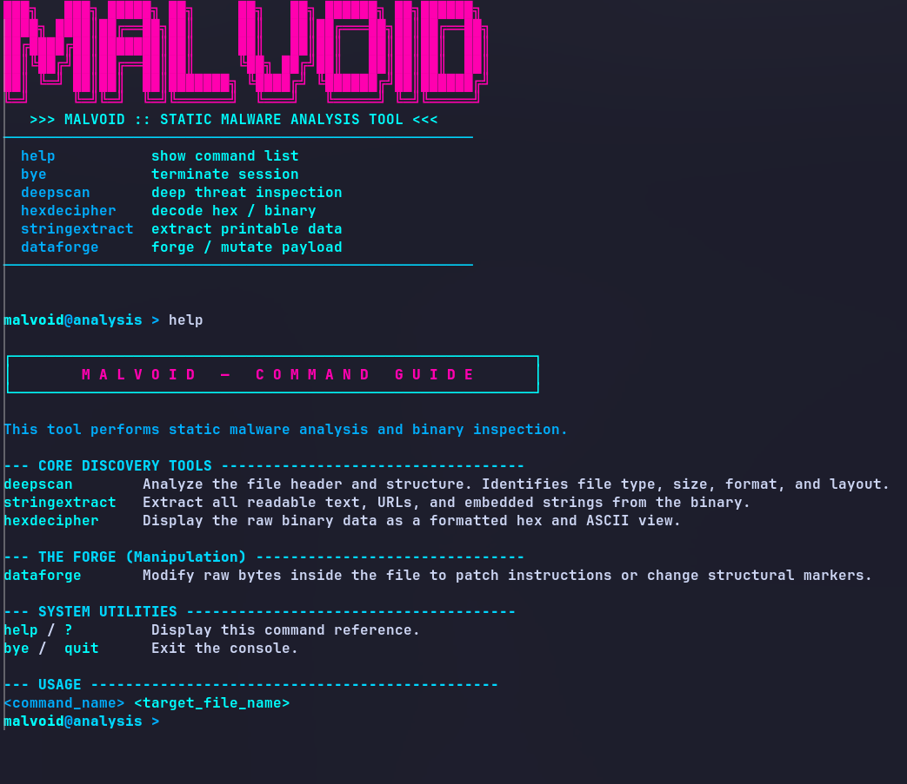

<div align="center">
  
</div>


<p align="center">
  <b>Static Malware Analysis & Reverse Engineering Tool</b><br>
  Inspect. Understand. Dissect. Without Execution.
</p>

<p align="center">
  
  
  
  
  
</p>


## Table of Contents
- [Overview](#overview)
- [Design Approach](#design-approach)
- [Features](#features)
- [Design Principles](#design-principles)
- [Getting Started](#getting-started)
  - [Requirements](#requirements)
  - [Installation](#installation)
- [Usage](#usage)
- [Output](#output)
- [Uninstall](#uninstall)
- [Contact](#contact)


## Overview

Malvoid is a static malware analysis and reverse engineering tool designed for inspecting executable files and understanding their internal structure without executing them.

It is intended for analysts who require transparency, determinism, and control over the analysis process. Malvoid focuses exclusively on static inspection and does not perform execution, emulation, or sandboxing.

The tool is suitable for:
- Manual malware inspection
- Binary structure exploration
- Reverse engineering workflows
- Educational and research use


## Design Approach

Malvoid is built around three core ideas:

| Principle        | Description                                    |
|------------------|------------------------------------------------|
| Static First     | No execution, no runtime interaction           |
| Analyst Control | The user directs every step of the analysis   |
| Minimal Surface | No unnecessary dependencies or automation     |


## Features

- Display raw file contents in hexadecimal form
- Extract readable strings from binary files
- Inspect file headers and basic structural information
- Manually modify individual bytes for controlled analysis
- Provide clear terminal output suitable for inspection


## Design Principles

- Static analysis only; no execution or emulation  
- Deterministic and reproducible behavior  
- Explicit and minimal dependencies  
- Clear separation between parsing and presentation  
- Predictable and stable output format  


## Getting Started

Malvoid is designed to be simple to build and use on standard Linux systems without requiring complex tooling or external runtimes. The project is intentionally kept minimal so that it can be audited, built, and executed in controlled environments. The build process uses only a C compiler and GNU Make, making it suitable for secure systems, research environments, and minimal installations.

Malvoid does not require any network access, background services, or privileged execution to perform analysis. It operates entirely on local files provided by the user and performs only static inspection.


## Requirements

- Linux system  
- `gcc` (or compatible C compiler)  
- `make`  

No runtime dependencies are required.


## Installation

### Arch-based distributions

```bash
yay -S malvoid-analysis
```
### Other Linux-based distributions

```
git clone https://github.com/Akash420-oss/Malvoid.git
cd Malvoid
make install
```

## Usage

Run Malvoid with root privileges:

```bash
sudo malvoid
help
```

## Output

<p>
Malvoid currently shows output through its built in help screen. The <code>help</code> command displays a single-page list of available commands and their usage.
</p>

<p>
The image below shows the help screen as it appears in the terminal:
</p>

<p align="center">
  
</p>

<p>
This screen is intended as a quick reference for users while working with the tool. It does not display or process any file content.
</p>

## Uninstall

### Arch-based distributions

```bash
yay -Rns malvoid-analysis
```

### Manual removal

```bash
make clean
```

## Contact

Maintained by **Akash Sil**.

Bug reports, feature requests, and contributions are welcome. Please use the GitHub issue tracker or open a pull request.
